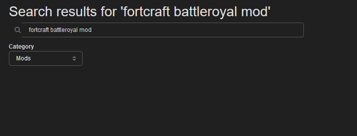

# Curseforge-Userscripts
Some useful userscripts for curseforge.com. Feel free to PR or create issues for features you want added. They work well with [Curse Dark by its_meow](https://itsmeow.dev/cursedark/).

## Install
To install these userscripts, you will need a supported userscript manager for your browser. I highly recommend Tampermonkey, which is available for all popular browsers:

- [Chrome](https://chrome.google.com/webstore/detail/tampermonkey/dhdgffkkebhmkfjojejmpbldmpobfkfo)
- [Firefox](https://addons.mozilla.org/firefox/addon/tampermonkey/)
- [Safari](http://tampermonkey.net/?browser=safari)
- [Microsoft Edge](https://www.microsoft.com/store/p/tampermonkey/9nblggh5162s)
- [Opera](https://addons.opera.com/extensions/details/tampermonkey-beta/)

Once you have installed a userscript manager, click the following links to install userscripts from this repository:

- [No More MCreator Mods](https://github.com/comp500/Curseforge-Userscripts/raw/master/banhammer.user.js)
- [Curseforge Quality Of Life Fixes](https://github.com/comp500/Curseforge-Userscripts/raw/master/cfqol.user.js)

They can also be installed from [Greasy Fork](https://greasyfork.org/en/users/331451-comp500).

## Curseforge Quality Of Life Fixes
This userscript fixes a few annoying problems I had with Curseforge. It does the following:

- Adds a search bar to the top navigation bar that searches mods

	
- Changes the default action of the "Browse" link (in the top navigation bar) and the Minecraft logo on that page to the Mods tab of Minecraft

	
- Adds a tab to mod pages that allows all the files to be viewed, rather than just the recent files - normally hidden behind a "View All" button

	

## No More MCreator Mods
This userscript attempt to determine which mods are MCreator mods on the Curseforge site, and hide them! It may cause excessive bandwidth usage (it often downloads the actual mod to check if is a MCreator mod) and is more of an experiment than an actual userscript.

