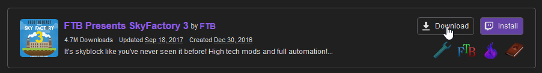
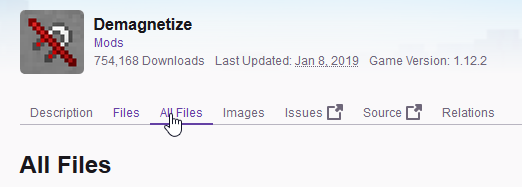
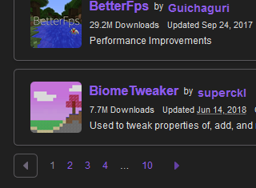
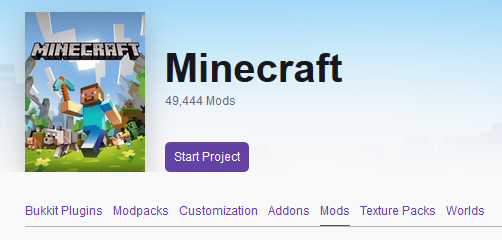
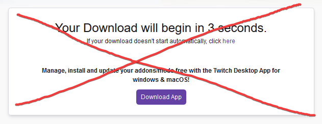
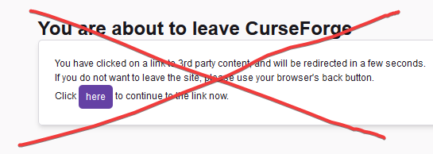
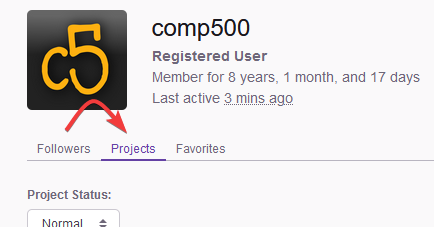
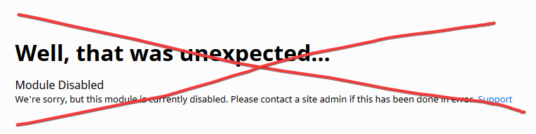

# Curseforge Userscripts
Some useful userscripts for curseforge.com. Feel free to PR or create issues for features you want added. They work well with [Curse Dark by its_meow](https://itsmeow.dev/cursedark/). If you want your own userscript to be listed here, submit an issue!

## Install
To install these userscripts, you will need a supported userscript manager for your browser. I highly recommend Tampermonkey, which is available for all popular browsers:

- [Chrome](https://chrome.google.com/webstore/detail/tampermonkey/dhdgffkkebhmkfjojejmpbldmpobfkfo)
- [Firefox](https://addons.mozilla.org/firefox/addon/tampermonkey/)
- [Safari](http://tampermonkey.net/?browser=safari)
- [Microsoft Edge](https://www.microsoft.com/store/p/tampermonkey/9nblggh5162s)
- [Opera](https://addons.opera.com/extensions/details/tampermonkey-beta/)

Once you have installed a userscript manager, click the following links to install userscripts from this repository:

- [Curseforge Quality Of Life Fixes](https://github.com/comp500/Curseforge-Userscripts/raw/master/cfqol.user.js)
- [Redirect Old Links](https://github.com/comp500/Curseforge-Userscripts/raw/master/redir.user.js)

They can also be installed from [Greasy Fork](https://greasyfork.org/en/users/331451-comp500).

## Curseforge Quality Of Life Fixes
This userscript fixes a few annoying problems with Curseforge. If you have any suggestions, please submit them as issues or [ping me on Discord](https://discord.mcmoddev.com/)!

### Features
- Adds a search bar to the top navigation bar that searches mods (and removes the Minecraft Forums link to make space)

	
- Readds modpack download buttons, because they removed them. Useful for people using alternative launchers.

	
- Adds a tab to mod and modpack pages that allows all the files to be viewed, rather than just the recent files - normally hidden behind a "View All" button

	
- Adds pagination for dependency lists to the bottom of the page, so you don't have to scroll up!

	
- Changes the default action of the "Browse" link (in the top navigation bar) and the Minecraft logo on the homepage to the Mods tab of Minecraft

	
- Automatically follows the 5 second download redirect for you, so you don't have to wait. Works best with version-specific download buttons.

	
- Automatically follows the "You are about to leave Curseforge" message for you, so you don't have to wait.

    
- Changes the default user tab to "Projects", because most of the time that's what you actually want to see.

	

## Redirect Old Links
When Curseforge redesigned their site, they moved mods from minecraft.curseforge.com to www.curseforge.com/minecraft. It doesn't seem to redirect the old links to the new ones any more, so this userscript will do it for you. For some reason the new site also doesn't support viewing mods by Addon ID anymore, so this script will resolve the IDs if they exist in the old links.

